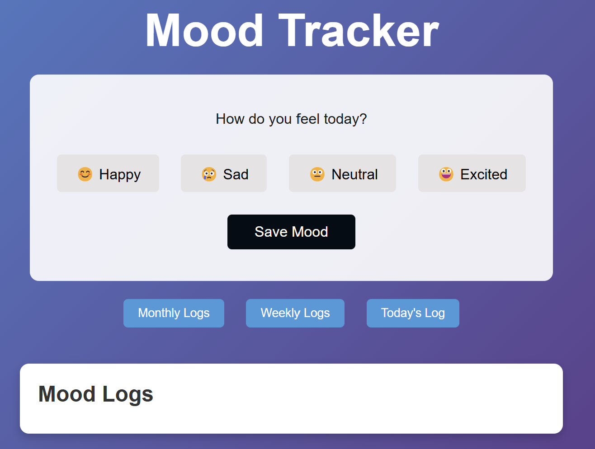
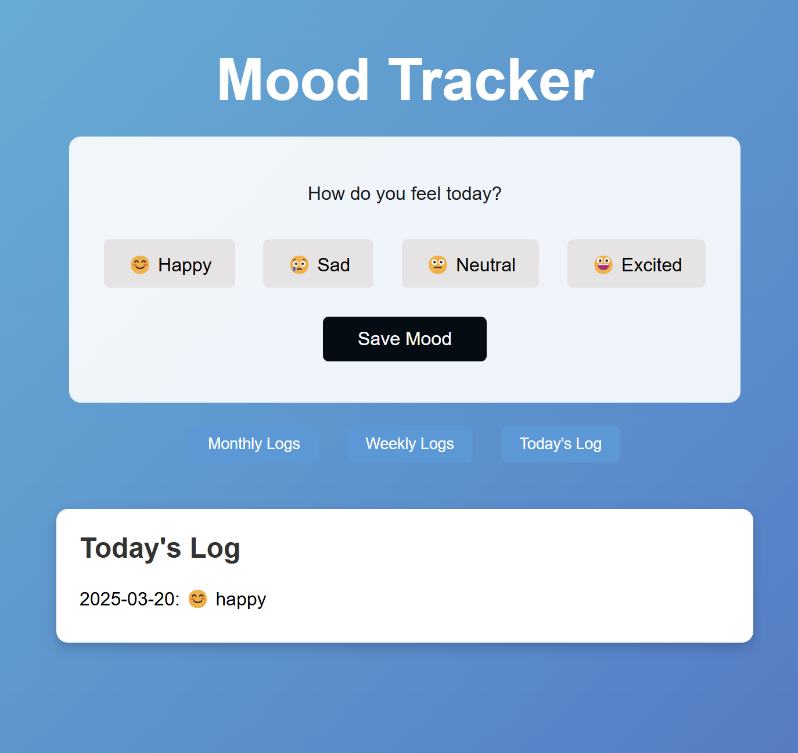
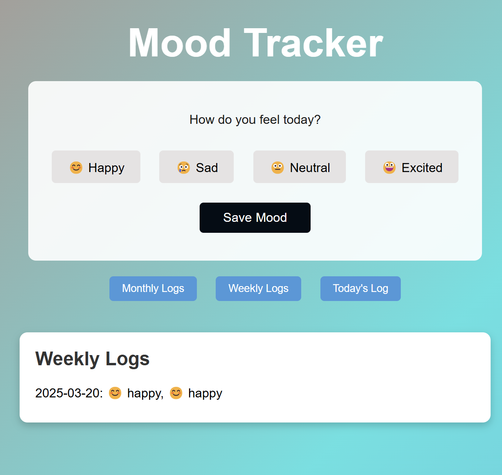
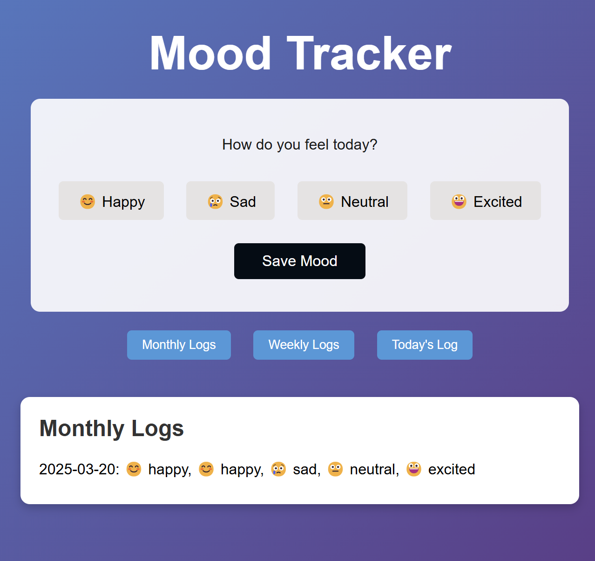

# Mood Tracker

A web app to log and track daily moods with filtering options.

## Features
- Log multiple moods per day (Happy, Sad, Neutral, Excited) with emojis.
- Filter by "Today's Log," "Weekly Logs," or "Monthly Logs."
- Dynamic title updates based on filter.
- Persistent storage using `localStorage`.

## Screenshots

## Deployment Link
[Live Demo](https://mood-tracker-brown-pi.vercel.app/)

## Technologies Used
- HTML
- CSS
- JavaScript
- `localStorage`
